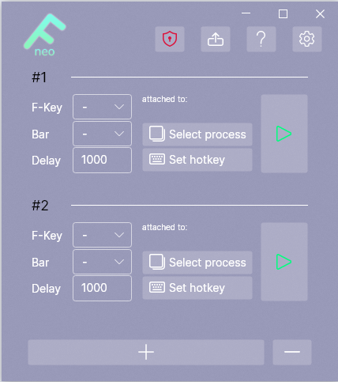

----
f.neo is a function-key and/or decimal-number-key spam tool for Flyff.\
I already made a tool like this some time ago but it kind of sucked and i needed a project to try out [Avalonia](https://avaloniaui.net/).

&nbsp;

&nbsp;
## New features:
- Full persistance (including attempt to restore previously attached processes.)
- Customizable Hotkeys.
- Unlimited Slots.
- Audio Feedback on activation.
- Settings menu.
- Detects when not ran as administrator.
- Detachable compact dock 
- Cool new UI

## What do the different versions mean?
The self contained versions have everything needed to run contained in one file (which in return makes them quite large.) while the framework dependent versions do not and thus require a installation of the .NET 6 framework on your computer.

## You found a bug or have improvement ideas?
Feel free to create a new issue here on github.
